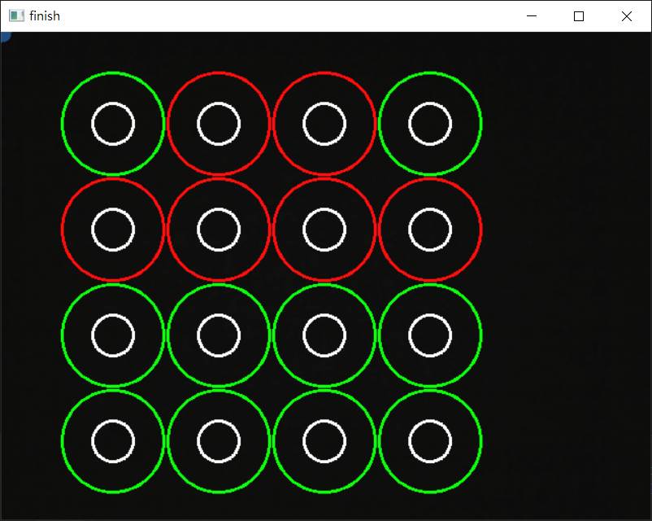

# UX Design
- 這是一個課堂的分組專題，主要在於使用 OpenCV 設計一款符合使用者經驗設計的小遊戲。
- 使用的軟體及技術：Visual Studio Code、OpenCV、C++、Visual Studio 2019 Community、MinGW、CMake。
## 作品展示
遊戲規則：使用藍色的物品（e.g. 藍筆）來移動左上角的小圓點，小圓點移動到白色圓圈內會改變自己與相鄰圓圈的顏色（紅變綠，綠變紅），當畫面中所有圓圈的顏色皆變為綠色即為通關。

